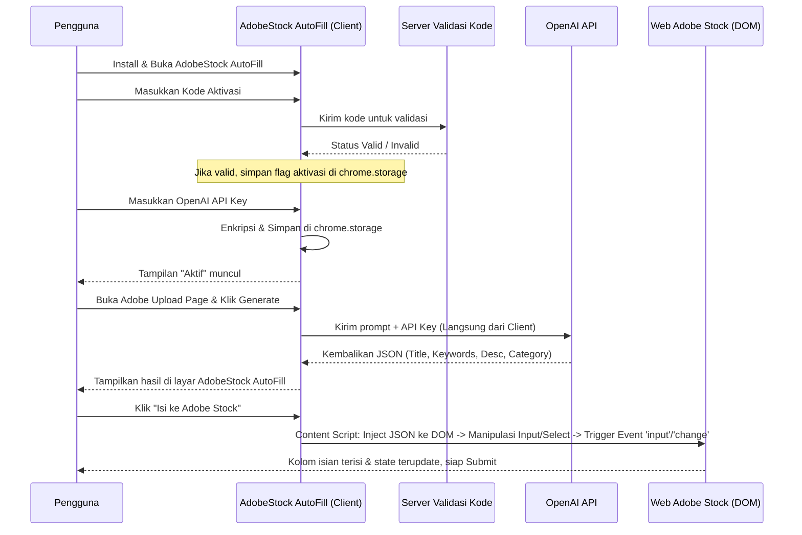
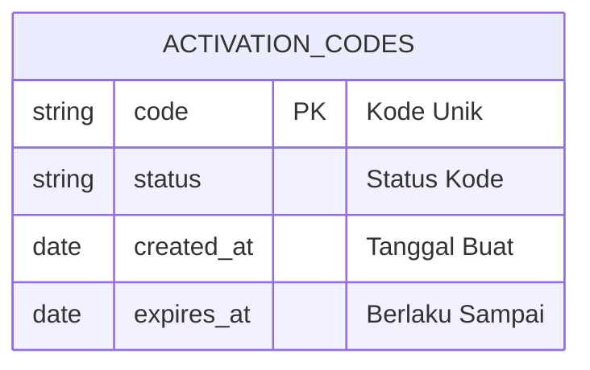

# PRD — Project Requirements Document

## 1. Overview
Mengunggah foto atau aset digital ke platform *microstock* seperti Adobe Stock Contributor seringkali menjadi proses yang membosankan dan memakan waktu. Para desainer dan fotografer (*microstocker*) harus memikirkan dan mengetik judul, deskripsi, kategori, dan puluhan kata kunci (keyword) secara manual untuk setiap karya. 

**AdobeStock AutoFill** adalah sebuah **Google Chrome Extension (Ekstensi Chrome)** yang dirancang khusus untuk menyelesaikan masalah tersebut. Aplikasi ini bertujuan membantu *microstocker* mengisi metadata (judul, deskripsi, kategori, dan kata kunci) secara otomatis di halaman Adobe Stock. Berbeda dengan model berlangganan berbasis akun, AdobeStock AutoFill menggunakan sistem **Kode Aktivasi + OpenAI API Key** pengguna sendiri. Dengan AdobeStock AutoFill, pengguna dapat menghemat waktu secara drastis, menjaga privasi data, bekerja lebih cepat, dan pada akhirnya dapat mengunggah lebih banyak karya tanpa壁垒 login rumit.

## 2. Requirements
- **Platform:** Ekstensi browser Google Chrome.
- **Deteksi Halaman:** AdobeStock AutoFill hanya akan aktif secara maksimal saat pengguna berada di halaman portal Adobe Stock Contributor.
- **Koneksi AI:** Membutungkan OpenAI API Key yang dimasukkan secara mandiri oleh pengguna untuk meracik kata kunci, judul, dan kategori yang relevan.
- **Validasi Akses (Activation Code):** Tidak ada sistem login akun. Akses fitur inti dikontrol melalui Kode Aktivasi unik yang divalidasi sebelum penggunaan.
- **Manipulasi Halaman:** AdobeStock AutoFill harus memiliki kemampuan untuk menuliskan teks secara otomatis ke dalam kolom input di situs Adobe Stock.
- **Penyimpanan Aman:** API Key dan status aktivasi disimpan secara lokal di browser (chrome.storage) dengan enkripsi standar, tanpa transmisi ke server pihak ketiga.

## 3. Core Features
- **Buat Judul & Deskripsi Cerdas:** Menggunakan OpenAI API untuk menghasilkan judul dan deskripsi foto secara otomatis berdasarkan gambar atau kata kunci dasar yang diolah oleh AdobeStock AutoFill.
- **Pembuat Kata Kunci (Keyword Generator):** AdobeStock AutoFill menghasilkan puluhan kata kunci yang paling relevan dengan standar pencarian aset digital.
- **Isi Otomatis (Auto-Fill):** Satu tombol klik di AdobeStock AutoFill untuk secara otomatis mengisi kolom *Title*, *Keywords*, *Description*, dan memilih *Category* langsung di halaman Adobe Stock Contributor. 
  *Detail Teknis:* AdobeStock AutoFill menggunakan fitur `content_scripts` untuk menyuntikkan modul ke dalam halaman Adobe Stock. Sistem akan mengidentifikasi elemen form melalui CSS selector yang stabil (misalnya `input[name="title"]`, elemen `textarea` deskripsi, kontainer input keywords, dan dropdown `<select>` kategori). Setelah nilai teks dan array kata kunci dari respons OpenAI (format JSON) diterima, AdobeStock AutoFill akan langsung memanipulasi properti DOM (`element.value` atau `element.textContent`). Untuk memastikan framework frontend Adobe mendeteksi perubahan, AdobeStock AutoFill secara terprogram akan memicu event `input` dan `change` (`dispatchEvent(new Event('input', { bubbles: true }))`) sehingga state form Adobe terupdate secara real-time tanpa membutuhkan interaksi mouse/keyboard manual.
- **Kustomisasi Metadata:** Pengguna tetap dapat mengedit, menambah, atau mengurangi hasil yang dibuat oleh AdobeStock AutoFill sebelum disimpan/diserahkan ke form.
- **Notifikasi Browser:** Pemberitahuan real-time menggunakan `chrome.notifications` atau `Notification API` saat proses analisis AI selesai, API Key error, atau status aktivasi berubah, yang dikelola langsung oleh AdobeStock AutoFill.

## 4. User Flow
1. **Pasang Ekstensi:** Pengguna mengunduh dan menginstal AdobeStock AutoFill ke browser Chrome melalui halaman `chrome://extensions`.
2. **Aktivasi Perangkat:** Pengguna membuka *popup* AdobeStock AutoFill, memasukkan Kode Aktivasi yang valid, dan menekan "Verifikasi". Sistem memvalidasi kode (lokal/server).
3. **Konfigurasi AI:** Setelah kode valid, pengguna diminta memasukkan OpenAI API Key pribadi ke kolom penyedia kunci. Sistem menyimpan kunci tersebut secara terenkripsi di penyimpanan lokal browser.
4. **Penggunaan & Auto-Fill di Adobe Stock:** Pengguna membuka halaman pengunggahan Adobe Stock Contributor, mengklik ikon AdobeStock AutoFill, lalu memilih opsi "Buat Metadata". Setelah AI menyelesaikan analisis, pengguna meninjau hasil di panel AdobeStock AutoFill. Dengan menekan tombol "Isi ke Adobe Stock", AdobeStock AutoFill akan menjalankan *content script* yang mencari elemen form via selector spesifik, memanipulasi nilai DOM (`value`/`textContent`), dan mensimulasikan event input (`dispatchEvent(new Event('input', { bubbles: true }))`) agar form Adobe Stock secara instan terisi dan siap diklik 'Submit'.
5. **Finalisasi:** Pengguna melakukan pengecekan cepat (review) dan menyelesaikan proses pengunggahan melalui antarmuka bawaan Adobe Stock.

## 5. Architecture
Berikut adalah gambaran sederhana tentang bagaimana sistem AdobeStock AutoFill bekerja, dari ekstensi di browser pengguna hingga ke API OpenAI. Backend hanya diperlukan untuk validasi kode aktivasi sesaat; setelahnya, komunikasi AI berjalan langsung dari klien (ekstensi) ke OpenAI.

**Teknikal Auto-Fill & Manipulasi DOM pada AdobeStock AutoFill:**
Proses pengisian otomatis tidak menggunakan simulasi klik mouse standar, melainkan manipulasi DOM terprogram untuk memastikan kompatibilitas dengan framework modern Adobe (React/Vue/vanilla). Alur teknisnya sebagai berikut:
1. **Query Selector:** Content script AdobeStock AutoFill memindai halaman untuk menemukan elemen target berdasarkan atribut `data-testid`, `placeholder`, atau `name` yang relatif stabil.
2. **Penulisan Nilai:** Nilai teks (Title/Description) dan array kata kunci (yang kemudian di-join dengan koma) ditulis langsung ke properti `value` atau `innerText` elemen.
3. **Fire Custom Event:** Karena perubahan `value` secara langsung tidak selalu memicu validator framework, AdobeStock AutoFill wajib memicu `Event('input', { bubbles: true })` dan `Event('change', { bubbles: true })` pada elemen terkait.
4. **Wait & Verify:** AdobeStock AutoFill menunggu singkat atau memantau atribut `class`/`data-state` untuk memastikan Adobe Stock menerima input dan tidak mengembalikan pesan error "kolom wajib diisi".

## 6. Database Schema
Karena autentikasi berbasis akun dihapus, struktur database disederhanakan. Server hanya menyimpan data kode aktivasi. Data pengguna (API Key, status, riwayat) disimpan secara lokal di browser pengguna oleh AdobeStock AutoFill.

**Daftar Tabel (Server - SQLite):**
1. **ActivationCodes:** Menyimpan daftar kode yang sah.
   - `code` (String) - Kode aktivasi unik (Primary Key).
   - `status` (Enum) - `ACTIVE`, `USED`, `REVOKED`.
   - `created_at` (Date) - Waktu pembuatan kode.
   - `expires_at` (Date) - Masa berlaku kode (opsional).

**Penyimpanan Lokal (Client - chrome.storage.local/secureStorage):**
1. **Settings:** Menyimpan konfigurasi pengguna di mesin lokal.
   - `activation_status` (Boolean) - Status aktif tidaknya AdobeStock AutoFill.
   - `openai_api_key` (String) - Kunci API terenkripsi.
   - `usage_count` (Integer) - Jumlah generate yang sudah dipakai (untuk limit lokal).
   - `last_generated` (Date) - Riwayat terakhir generate metadata.

## 7. Tech Stack
Untuk membangun AdobeStock AutoFill dan validasi server pendukung ini dengan cepat, modern, dan hemat biaya:

- **Frontend (Chrome Extension UI):** React.js dengan **Tailwind CSS** dan **shadcn/ui** (menggunakan framework **Plasmo** untuk manajemen manifest & state yang optimal).
- **Backend (Server & API Validasi):** **Next.js** (API routes sederhana hanya untuk memverifikasi Kode Aktivasi).
- **Database Server:** **SQLite** — ringan, cocok hanya untuk tabel kode aktivasi.
- **ORM:** **Drizzle ORM** — querying ringan tanpa overhead berat.
- **Validasi Akses:** Middleware kustom pada route Next.js untuk mencocokkan input user dengan tabel `ActivationCodes`. Mengembalikan state `200 OK` atau `403 Forbidden`.
- **Penyimpanan Klien:** `chrome.storage.local` & `chrome.secureStorage` untuk menyimpan API Key & status aktivasi secara aman di browser.
- **Kecerdasan Buatan (AI):** **OpenAI API** (Direct Client-Side Call) — AdobeStock AutoFill secara langsung berkomunikasi ke endpoint OpenAI menggunakan API Key user sendiri, menghindari biaya proxy server.

## 8. MVP Priority
Fokus pengembangan AdobeStock AutoFill dibagi menjadi tiga fase prioritas untuk memastikan produk cepat diluncurkan dengan alur validasi kunci yang stabil sebelum menambah fitur pendukung.

- **Fase 1 (MVP Core - Priority 1):** 
  - Sistem Kode Aktivasi (Install → Enter Code → Validate → Unlock)
  - Input & Penyimpanan Aman OpenAI API Key (client-side)
  - Integrasi AI untuk generate Judul, Deskripsi, Kata Kunci, dan Kategori
  - Fitur Auto-Fill otomatis ke form Adobe Stock Contributor (melalui manipulasi DOM & trigger event)
  - *Tujuan:* Membuktikan nilai inti AdobeStock AutoFill ("Upload lebih cepat tanpa akun") serta memvalidasi keamanan penyimpanan API Key dan akurasi auto-fill pada DOM Adobe.

- **Fase 2 (Feedback & Usability - Priority 2):**
  - Notifikasi Browser (proses AI selesai, error API key, status limit)
  - Kustomisasi Metadata (edit manual sebelum apply, copy-paste terpisah)
  - Riwayat penggunaan lokal & manajemen batas harian (rate limit client-side)
  - *Tujuan:* Meningkatkan kepercayaan pengguna, memungkinkan koreksi cepat, dan membangun kebiasaan penggunaan harian tanpa backend berat.

- **Fase 3 (Skalabilitas & Bisnis - Priority 3):**
  - Sistem pembelian/renewal kode aktivasi (integrasi pembayaran ke generator kode)
  - Dukungan multi-format/aset digital lain (video, ilustrasi)
  - Panel statistik ringan (jumlah generate, rata-rata waktu hemat)
  - *Tujuan:* Monetisasi berkelanjutan, perluasan audiens, dan optimasi bisnis berbasis data penjualan kode.

*Catatan Pengembang:* Seluruh sumber daya awal dialokasikan ke Fase 1. Prioritas utama adalah memastikan alur "Validasi Kode → Konfigurasi API Key → Auto-Fill Metadata" pada AdobeStock AutoFill berjalan mulus, aman, dan tidak melanggar kebijakan keamanan atau ToS Adobe Stock. Fitur Fase 2 hanya dimulai setelah ekstensi terbukti stabil di berbagai template upload Adobe.